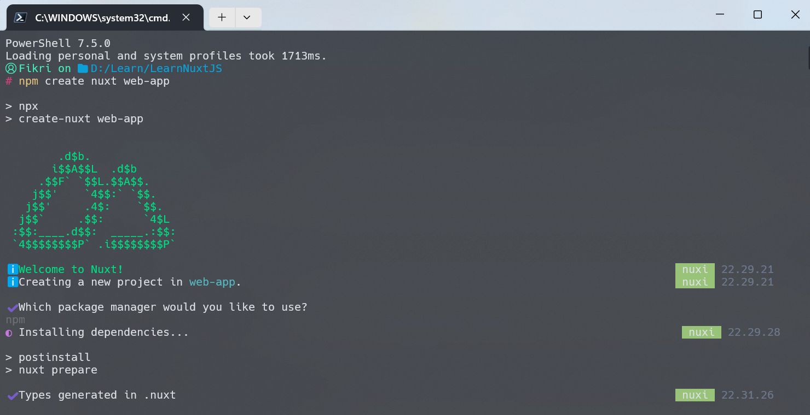

## Day 1 : March 27, 2025

**Today's Progress :**  
i decided to learn nuxt js as a front end development framework and tried to install it. and read some documentation

for the first time, it looks easy to learn nuxt js. i hope so for the next days

**Work(s) :**
- install nuxt js framework
- read documentation
- explore the folder structure of nuxt js

## Day 2 : March 28, 2025

**Today's Progress :**  
this day i learn how to make and use component in nuxt js (i mean, Vue js). i search about this concept, and i found that this component actually can be made even without vue js. it's called web components technology. so, this day i'm focusing on understanding about web components, specifically `template` tag, `slot` tag, and how to use them. it's pretty easy, isn't?

**Work(s) :**
- [Template and Slots](resources/n11.md)
